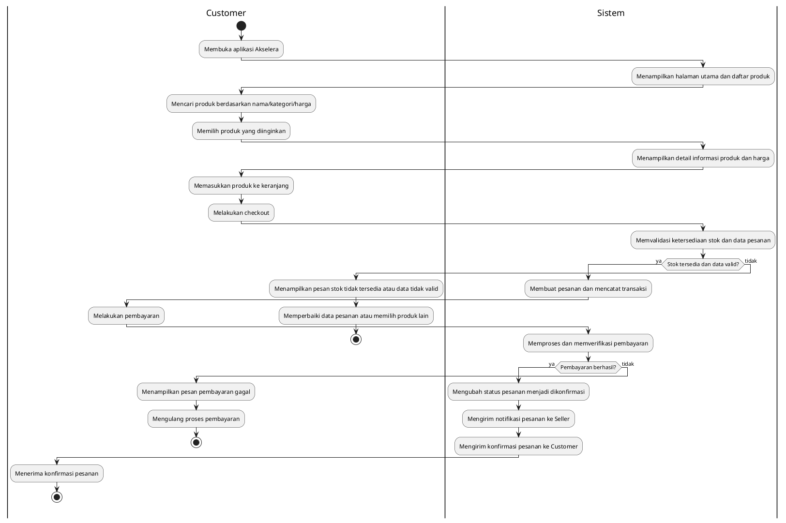

```plantuml
@startuml

|Customer|
start
:Membuka aplikasi Akselera;

|Sistem|
:Menampilkan halaman utama dan daftar produk;

|Customer|
:Mencari produk berdasarkan nama/kategori/harga;
:Memilih produk yang diinginkan;

|Sistem|
:Menampilkan detail informasi produk dan harga;

|Customer|
:Memasukkan produk ke keranjang;
:Melakukan checkout;

|Sistem|
:Memvalidasi ketersediaan stok dan data pesanan;

if (Stok tersedia dan data valid?) then (ya)
    :Membuat pesanan dan mencatat transaksi;

    |Customer|
    :Melakukan pembayaran;

    |Sistem|
    :Memproses dan memverifikasi pembayaran;

    if (Pembayaran berhasil?) then (ya)
        :Mengubah status pesanan menjadi dikonfirmasi;
        :Mengirim notifikasi pesanan ke Seller;
        :Mengirim konfirmasi pesanan ke Customer;

        |Customer|
        :Menerima konfirmasi pesanan;
        stop
    else (tidak)
        :Menampilkan pesan pembayaran gagal;

        |Customer|
        :Mengulang proses pembayaran;
        stop
    endif
else (tidak)
    :Menampilkan pesan stok tidak tersedia atau data tidak valid;

    |Customer|
    :Memperbaiki data pesanan atau memilih produk lain;
    stop
endif

@enduml
```
