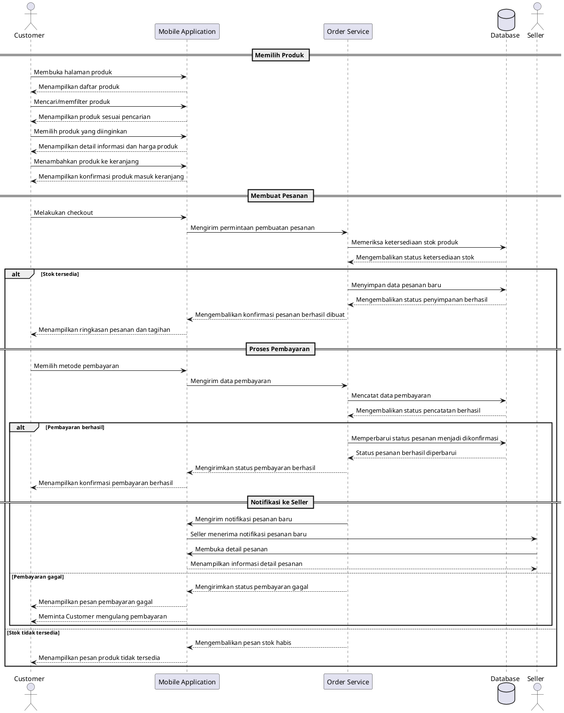

```plantuml
@startuml

actor Customer
participant "Mobile Application" as App
participant "Order Service" as Order
database "Database" as DB
actor Seller

== Memilih Produk ==

Customer -> App : Membuka halaman produk
App --> Customer : Menampilkan daftar produk

Customer -> App : Mencari/memfilter produk
App --> Customer : Menampilkan produk sesuai pencarian

Customer -> App : Memilih produk yang diinginkan
App --> Customer : Menampilkan detail informasi dan harga produk

Customer -> App : Menambahkan produk ke keranjang
App --> Customer : Menampilkan konfirmasi produk masuk keranjang

== Membuat Pesanan ==

Customer -> App : Melakukan checkout
App -> Order : Mengirim permintaan pembuatan pesanan
Order -> DB : Memeriksa ketersediaan stok produk
DB --> Order : Mengembalikan status ketersediaan stok

alt Stok tersedia
    Order -> DB : Menyimpan data pesanan baru
    DB --> Order : Mengembalikan status penyimpanan berhasil
    Order --> App : Mengembalikan konfirmasi pesanan berhasil dibuat
    App --> Customer : Menampilkan ringkasan pesanan dan tagihan

    == Proses Pembayaran ==

    Customer -> App : Memilih metode pembayaran
    App -> Order : Mengirim data pembayaran
    Order -> DB : Mencatat data pembayaran
    DB --> Order : Mengembalikan status pencatatan berhasil

    alt Pembayaran berhasil
        Order -> DB : Memperbarui status pesanan menjadi dikonfirmasi
        DB --> Order : Status pesanan berhasil diperbarui
        Order --> App : Mengirimkan status pembayaran berhasil
        App --> Customer : Menampilkan konfirmasi pembayaran berhasil

        == Notifikasi ke Seller ==

        Order -> App : Mengirim notifikasi pesanan baru
        App -> Seller : Seller menerima notifikasi pesanan baru
        Seller -> App : Membuka detail pesanan
        App --> Seller : Menampilkan informasi detail pesanan

    else Pembayaran gagal
        Order --> App : Mengirimkan status pembayaran gagal
        App --> Customer : Menampilkan pesan pembayaran gagal
        App --> Customer : Meminta Customer mengulang pembayaran
    end

else Stok tidak tersedia
    Order --> App : Mengembalikan pesan stok habis
    App --> Customer : Menampilkan pesan produk tidak tersedia
end

@enduml

```
